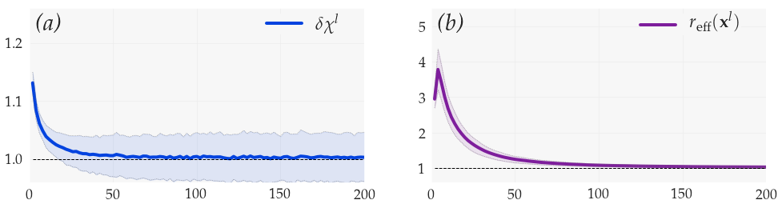
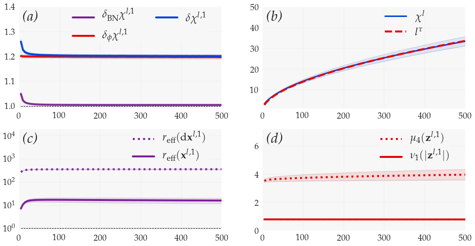

# Characterizing Well-behaved vs. Pathological Deep Neural Networks

Code for the paper “Characterizing Well-behaved vs. Pathological Deep Neural Networks”: https://arxiv.org/abs/1811.03087 

## Setup
This package has been tested with python 2.7 and 3.7.

First, you need to install all necessary python dependencies:
```sh
cd moments-dnns
sudo pip install -r requirements.txt   # optionally: sudo pip3 install -r requirements.txt
```
To run reasonably large experiments with convolutional networks, you will need to have tensorflow-gpu installed, e.g. with
```sh
sudo pip install tensorflow-gpu
```


## Description

The package is built on top of Keras. At the core of the package, four types of custom layers perform the simultaneous propagation of signal and noise:
* Convolutional layers
* Batch normalization layers
* Activation layers
* Addition layers to merge residual and skip-connection branches for resnets

There are also custom layers for the computation of the moments of signal and noise. Performing these computations inside the model rather than outside is much more effective both in terms of speed and memory usage.

The entry-point of the package is `run_experiment.py`. This file contains the function `run_experiment()` which runs an experiment with fixed parameters for a given number of realizations. The results of the experiment are saved as numpy arrays in the folder `npy/name_experiment/` with the parameter `name_experiment` set at the invocation of `run_experiment()`.

For an experiment with 1,000 realizations .npy files typically occupy a space of a few MB. This space can be optionally reduced by calling the function `prune_experiment()` in the file `manage_experiments.py`. This function enables to only retain the moments relevant for a specific type of plot.

The file `plots.py` provides function to plot the results of the experiments in situations equivalent to Fig. 2, 3, 4, 5 of the paper.


## Notebooks

A good way to familiarize with the package is to have a look at the notebooks. The *main notebook* `Reproducing Fig. 2, 3, 4, 5` shows the function calls as well as the results from Fig. 2, 3, 4, 5 of the paper.

There are two complementary notebooks 

- `Complements on boundary conditions, dataset, epsilon` discusses the influence of boundary conditions of convolutional layers, input dataset and batch normalization fuzz factor

- `Complements on fully-connected networks` discusses the results of experiments equivalent to Fig. 2, 3, 4, 5 for fully-connected networks

These complementary notebooks confirm the results of the paper and provide additional insights and examples of usage of the function `run_experiment()`.


## Results of the experiments

### Fig. 2:  Vanilla nets have second-order moments diffusing in log-space
This experiment considers in *ReLU vanilla nets* the evolution with depth of second-order moments of signal and noise. 

*Depth propagation with finite width induces a slow diffusion in log-space of these moments, which stay centered but eventually become fat-tailed distributed with diverging kurtosis.* 

The diffusion happens in log-space since layer composition is a multiplicative process in real space.


### Fig. 3: Vanilla nets are subject to the pathology of one-dimensional signal
This experiment considers in *ReLU vanilla nets* the evolution with depth of (i) geometric increments of the normalized sensitivity, (ii) the effective rank of the signal. The normalized sensitivity measures how the neural network degrades the signal-to-noise ratio, while the effective rank measures the effective dimensionality of the signal.

It is shown in the paper that the normalized sensitivity always increases with depth for ReLU vanilla nets. It is also shown that only two possibilities of evolution are available:

1. The normalized sensitivity explodes
2. The signal becomes one-dimensional

Experimentally, vanilla nets favor possibility 2. *The signal propagated by the neural network eventually becomes one-dimensional with a single feature visible for upper layers*.





### Fig. 4: Batch-normalized feedforward nets are subject to the pathology of exploding sensitivity
This experiment considers in *ReLU batch-normalized feedforward nets* the evolution with depth of (i) the normalized sensitivity and its increments, (ii) the effective ranks of the signal and noise, (iii) the moments of the signal.

*ReLU batch-normalized feedforward nets are subject to the pathology of exploding sensitivity, i.e. that depth propagation rapidly leads to these networks behaving as pure noise amplifiers*.

The amplification of the normalized sensitivity has two origins:
1. Batch normalization normalizing each channel by signal variance, thereby suppressing directions of high signal variance and amplifying directions of low signal variance
2. The ReLU nonlinearity


### Fig. 5: Batch-normalized resnets are well-behaved
This experiment considers in *ReLU batch-normalized resnets* the evolution with depth of (i) the normalized sensitivity and its increments, (ii) the effective ranks of the signal and noise, (iii) the moments of the signal.

We see a well-behaved evolution with:
1. The normalized sensitivity having power-law growth
2. High dimensionality of the signal being preserved

*Batch-normalized resnets are logarithmic versions of batch-normalized feedforward nets. In particular the whole evolution in Fig. 5 is very similar to the evolution at the very beginning of Fig. 4.*



